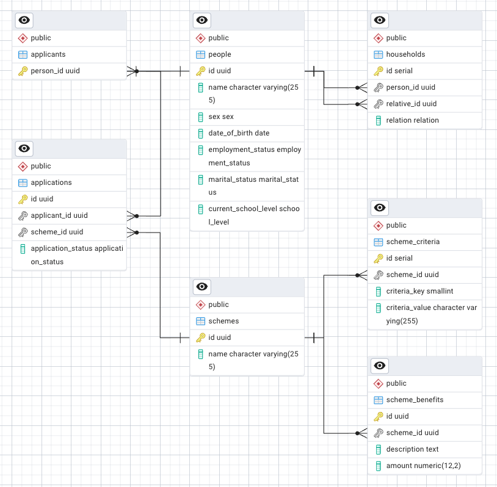

# Financial Assistance Scheme Management System


## Overview + Tech Stack
This project is a simple REST API server written in Go for managing financial assistance schemes for needy individuals and families.

The server is built on go-chi, and uses GORM to interface with a PostgreSQL database.

1. [Local Development](#local-development)
2. [Project Structure](#project-structure)
3. [Database Schema](#database-schema)
4. [API Documentation](#api-documentation)


## Local Development

### Prerequisites
1. Go 1.22. Download and install Go by following the instructions [here](https://go.dev/doc/install).
1. Docker compose. The easiest way to get docker compose is via installing [Docker Desktop](https://docs.docker.com/get-started/get-docker/), which includes Docker Engine and Docker CLI that are required by Compose.

### Getting Started
1. Make a copy of the `.env.example` file as `.env`, and add in the `DB_USERNAME` and `DB_PASSWORD` values.

2. Optionally, provide an email and pass for `PGADMIN_EMAIL` and `PGADMIN_PASSWORD` if you would like to use the pgAdmin client

3. Spin up the postgres container, which will be exposed on localhost at port number specified in `.env` (default to 5432)
```
docker compose up -d
```
This will also create up a pgadmin container, accessible via `http://localhost:<PGADMIN_PORT>/` if `PGADMIN_EMAIL` and `PGADMIN_PASSWORD` is provided.

4. Database operations (migrate, seed) are provided by the database tool at `/cmd/database/main.go`.
To migrate the database, run 
```
make migrateDB
```
For now, this will apply all migrations by default.

5. Optionally, seed the database
```
make seedDB
```
6. Start the server
```
make run
```


## Project Structure
The project folder is loosely structured around the MVC architecture (with models, views, and handlers/controller).
```
.
├── cmd
│   ├── database
│   │   └── main.go
│   └── server
│       └── main.go
├── internal
│   ├── api
│   ├── config
│   ├── database
│   ├── enums
│   ├── handlers
│   ├── middleware
│   ├── models
│   ├── params
│   ├── router
│   └── views
├── migrations
│   └── 20240922165259-setup-db.sql
├── seeds
|   └── seed.sql
└── ...
```


## Database Schema

The SQL (DDL) script to create the schema is found [here](./migrations/20240922165259-setup-db.sql).

To create the schema, run
```
make migrateDB
```
To remove the schema, run
```
make rollbackDB
```

### Key considerations
1. A `people` table is created to capture basic attributes shared among the applicants and their household members. This minimize unnecessary duplication in fields across tables, and also makes it easier if a household member becomes an applicant in the future. All applicants and household members are uniquely identified by their `person_id`.
1. Enum types are created for fields like `sex`, `employment_status`, `marital_status` etc. which have a fixed range of values that is rarely changed.
1. Scheme criteria are modelled using flat key-value pairs e.g. `"has_children": "true"`, `"children_school_level": "primary"`
1. Criteria keys are stored as an `int` in the database and maps to the corresponding criteria in the application code. Enum is not used in this case as there can be many criteria which may likely also change overtime.
1. `applications` table stores each applicant-scheme pair as one record.


## API Documentation
The API documentation is done on postman, and it is published [here](https://documenter.getpostman.com/view/29975782/2sAXqv4fcd).